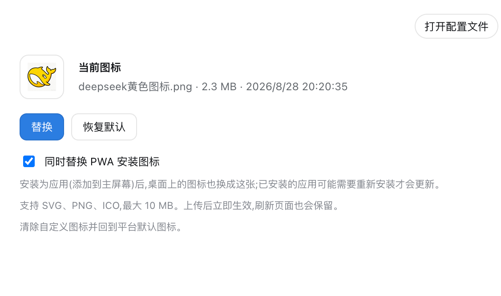
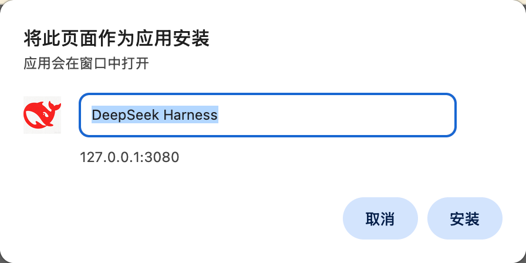

# dsh-icon-custom

Customize the browser tab icon (favicon) for DSH: upload an SVG / PNG / ICO from the settings page, it applies instantly and persists across reloads and restarts.

Zero third‑party runtime dependencies.

## Install

```sh
dsh plugin --profile web add dsh-icon-custom
```

Scoped name: `@cowwo/dsh-icon-custom`.

## Usage

1. Open **Settings → icon管理**.
2. Click **上传图标** and pick an SVG, PNG or ICO (up to 10 MB).
3. The current tab icon changes immediately; it is persisted under `$DSH_HOME/custom-favicon/`.
4. Click **恢复默认** to clear the custom icon and fall back to the platform favicon.

## PWA install icon

Tick **同时替换 PWA 安装图标** (checked state is remembered per icon) to also replace the icon of the installed PWA — the icon used on the desktop / home screen after the site is installed as an app. The plugin rewrites the `/manifest.webmanifest` icons entry to point at your icon (SVG is advertised as `sizes: "any"`, PNG reports its real dimensions, ICO its first entry). For iPhones/iPads a `<link rel="apple-touch-icon">` is pointed at the custom icon as well, which only works with a PNG (iOS ignores SVG touch icons).



When the site is installed as an app, the browser's install dialog picks the custom icon up:



Notes:

- The option is **off by default**: without it, behavior is identical to before and the platform manifest is served verbatim.
- The option can be toggled at any time after upload — no need to re-upload the file.
- Browsers re-check the manifest on their own schedule. An **already-installed** PWA usually keeps its old icon until you re-install it (or the browser's next manifest update picks up the new `src`).
- PNG is the recommended format for the PWA icon (UI / launcher icons are rasterized); the same uploaded file is used, never re-encoded.

## Format support

- **SVG** — recognized by content (`<svg`), validated against script / event‑handler / `javascript:` injection.
- **PNG** — recognized by magic bytes (tolerates a stray leading byte some optimizers emit), structurally checked to IHDR → … → IEND.
- **ICO / CUR** — CUR is accepted as ICO.

Files are stored verbatim (never re‑encoded), so transparency and quality are preserved.

## Persistence

Icons are stored per‑user under `$DSH_HOME/custom-favicon/`. "Reset" only clears the active marker; stored files are kept for a future icon‑library UI.

## License

MIT
