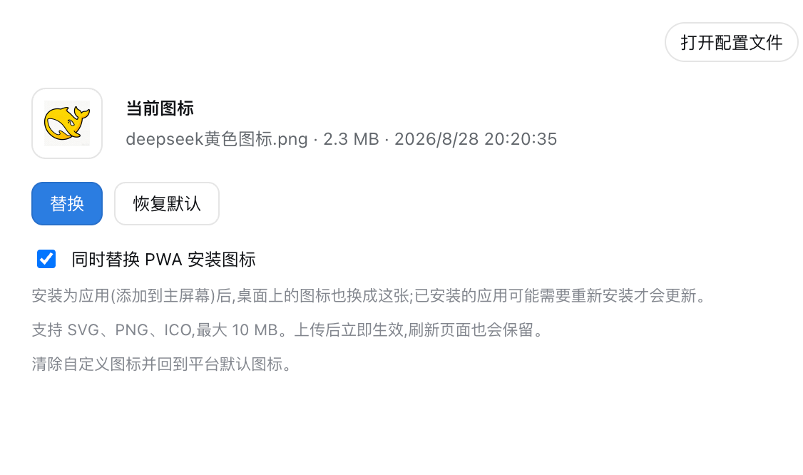
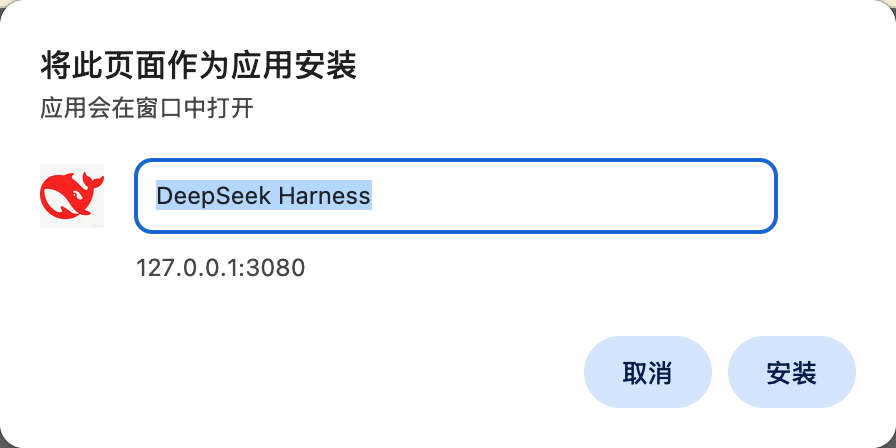

# dsh-icon-custom

Customize the browser tab icon (favicon) for DSH: upload an SVG / PNG / ICO / JPEG from the settings page, it applies instantly and persists across reloads and restarts. From 0.7.0 the PWA / logo path derives the canonical icon sizes automatically so the same upload works on Android, iOS and tablets.

Pure-JS dependency (`jimp`) — no native binaries, so it installs cleanly under pnpm's supply-chain policy.

## Install

```sh
dsh plugin --profile web add dsh-icon-custom
```

Scoped name: `@cowwo/dsh-icon-custom`.

## Usage

1. Open **Settings → icon管理**.
2. Click **上传图标** and pick an SVG, PNG or ICO (up to 10 MB).
3. The current tab icon changes immediately; it is persisted under `$DSH_HOME/custom-favicon/`.
4. Click **恢复默认** to clear the custom icon and fall back to the platform favicon.

## PWA install icon

Tick **同时替换 PWA 安装图标** (checked state is remembered per icon) to also replace the icon of the installed PWA — the icon used on the desktop / home screen after the site is installed as an app. The plugin rewrites the `/manifest.webmanifest` icons entry to a canonical derived PNG set: **192×192 `any`**, **512×512 `any`**, and a **512×512 `maskable`** variant (opaque background) so Android launchers crop cleanly. For iPhones/iPads a `<link rel="apple-touch-icon">` points at a derived **180×180 opaque PNG** (iOS ignores SVG touch-icons and transparent images).

SVG is rasterized to a 512×512 PNG in the browser before upload, and ICO has its embedded PNG extracted server-side, so any format produces a usable cross-platform icon. A derivation failure falls back to serving the original upload. A well-prepared **512×512 PNG** gives the best results.

The option is **off by default**: without it, behavior is identical to before and the platform manifest is served verbatim. Browsers re-check the manifest on their own schedule, so an **already-installed** PWA usually keeps its old icon until you re-install it (or the browser picks up the new `src` on its next manifest fetch).



When the site is installed as an app, the browser's install dialog picks the custom icon up:



## Page logo mark

Tick **同时替换页面 Logo 图标** to also replace the whale mark at the top-left of the DSH page — the mark beside the `deepseek HARNESS` brand name. The brand **text is untouched**; the mark falls back to the official whale while the option is off. The change applies instantly and persists across reloads/restarts.

Notes:

- The option is **off by default**.
- It can be toggled at any time after upload — no re-upload needed.
- This only affects the sidebar brand mark (the one next to `deepseek HARNESS`); PWA/installed-app icons are a separate option above.

## App icon badge (the red dot on the system icon)

Once the page is **installed as an app**, the same unread number is also shown on the **system icon**. The switch lives in **Settings → icon管理 → unread badge** ("Badge the system app icon") and is **on by default**; the number is **exactly the page number** (one computation, no extra clamping), so the two can never disagree.

> ⚠️ **What it looks like on Windows depends on which browser installed the app**:
> - **Installed with Chrome**: Chrome **draws its own overlay icon** on the taskbar button — a **dark circle with the white number**, at the lower-right of the icon. **Not a red dot, and not part of our artwork.** Above 99 it shows `99+`.
> - **Installed with Edge**: Edge goes through the **Windows badge channel**, so the badge uses the system style. Microsoft's docs say both empty and numeric badges are supported, but on Windows 11 this machine still drew only a system-blue dot when calling `navigator.setAppBadge(7)` directly from DevTools (2026-10-01). The plugin now has a **5-second low-frequency watchdog** that keeps re-asserting a positive number, but whether Edge/Windows renders it as a number or a dot is ultimately up to the system. For a reliable number, installing with Chrome is the current workaround.
>
> Either way it exists **only while the app window is open**: close the window and it is gone (that is not a bug), and nothing can refresh it afterwards (there is no push server, so with no page running there is no code running).

Platform support as of 0.17.0 (every row has a source; see ADR 0005 / 0009):

| Platform | Badge | Status |
|---|---|---|
| Windows **Chrome** 81+ | Dark circle + **white number** (Chrome's own overlay icon, lower-right) | Confirmed by Chrome's docs screenshot + Chromium source; **not yet measured on this machine** |
| Windows **Edge** 81+ | Goes through the Windows badge channel; Microsoft's docs support numbers, but this machine measured the number being drawn as a dot | **Measured anomaly** (2026-10-01) |
| macOS **Chrome / Edge** 81+ | Dock badge (red, numeric) | Confirmed in source (MDN: Chrome supports Windows and macOS since 81; `badge_manager_delegate_mac.cc` → app shim → `NSApp.dockTile.badgeLabel`); **not measured on a Mac here**. Needs **no** notification permission, but only works for the **running installed app** |
| macOS **Safari 17+** ("Add to Dock", macOS Sonoma 14+) | Dock badge (red, numeric) | Supported per Apple's own documentation; it **only appears after notifications are granted** — that is what the permission row in settings is for |
| iOS / iPadOS Safari 16.4+ (Add to Home Screen) | Number on the home-screen icon | Supported; also **requires notifications to be granted first** (the "Allow notifications" button does that) |
| Android Chrome / Edge | — | **Not supported by the system**: Chromium compiles the badge implementation out on Android, and a launcher dot can only come from a **notification** (this plugin posts none) |
| HarmonyOS | — | No public evidence of any implementation; **expected unsupported** (native badges there are ArkTS-only) |
| Firefox / Linux Chromium | — | No API / no OS API — calls resolve and do nothing |

**About the "notifications permission" row (since 0.17.0)**: below the badge switch the settings page now shows one local reading (**granted / not granted / denied / no Notification API in this browser**) plus an "Allow notifications" button that appears only while the permission is still undecided (nothing left to ask once granted; once denied the browser refuses to prompt again, so the row says where to change it instead). It is **not a plugin switch** — it is Apple's rule: Safari ties the badge permission to the notifications permission, and a Dock or home-screen web app that has not been allowed to notify simply has its `setAppBadge()` calls dropped. **Chrome / Edge need none of this**, and the permission is only ever used to draw the badge — the plugin sends no notifications. If the permission moves outside the page (changed in System Settings, or prompted by another tab) the row follows; the moment it becomes *granted* the current number is re-asserted at once, because every earlier call was dropped while there was no permission.

The "Current environment" line in the settings page reports **local facts only** (secure context? API present? installed as an app?). It never promises a badge will appear, because **detecting the API is not delivery** (that is exactly the Android and Linux case, and WebKit adds a permission on top). Whether it really shows is up to the system.

Two behaviours that look like bugs but are not:

- **A "manual test" number typed in a normal browser tab produces no taskbar badge** — correct: the badge belongs to the **installed app window**; a plain tab's call is silently ignored.
- **No badge when the page is reached over LAN `http://192.168.x.x`** — the Badging API requires a secure context; the settings page then says to use localhost or https.

The reasoning (why no notifications are sent, why no service worker, why no platform gating) is recorded in [`docs/adr/0005-app-icon-badge.md`](./docs/adr/0005-app-icon-badge.md); the notifications-permission row (why it is probed separately, why it never gates the badge call) is in [`docs/adr/0009-notification-permission.md`](./docs/adr/0009-notification-permission.md).

## Format support

- **SVG** — recognized by content (`<svg`), validated against script / event‑handler / `javascript:` injection. Rasterized to PNG in the browser before upload.
- **PNG** — recognized by magic bytes (tolerates a stray leading byte some optimizers emit), structurally checked to IHDR → … → IEND.
- **ICO / CUR** — CUR is accepted as ICO. Its embedded PNG is extracted server-side; a BMP-only ICO is not rasterizable and falls back to the original.
- **JPEG** — accepted as-is and treated as a raster baseline.

The uploaded file is stored verbatim (never re‑encoded) so the favicon keeps its transparency and quality; the derived PWA / logo PNG set is generated separately from it.

## Persistence

Icons are stored per‑user under `$DSH_HOME/custom-favicon/`. "Reset" only clears the active marker; stored files are kept for a future icon‑library UI.

That directory also holds two JSON files: `unread.json` (which turn-end reasons count as unread) and `unread-seen.json` (the seen watermark, `{ version, seen: { sessionId → endAt } }`, capped at 400 entries and written temp-then-rename). Both are **disposable**: deleting the first restores the default rule, deleting the second makes each browser re-baseline at "the last time it was open" (which does not resurrect old dots). The watermark is host-owned on purpose — looked at on any device means read on every device — while each browser keeps its own copy as a cache and offline queue.

## License

MIT
